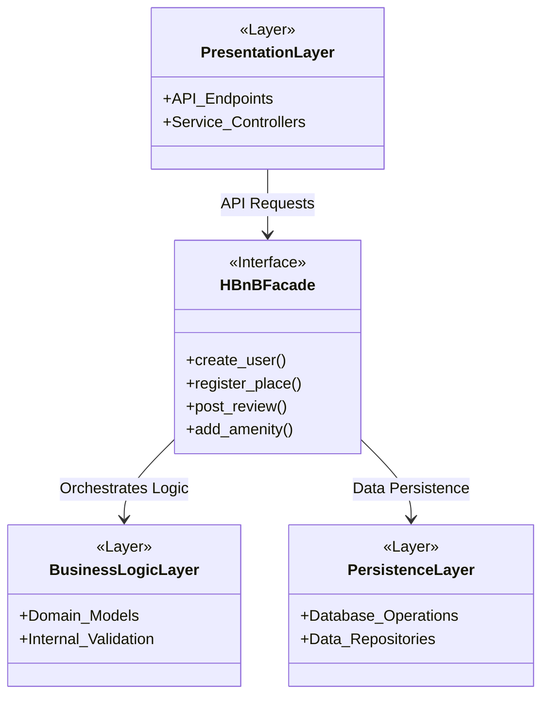
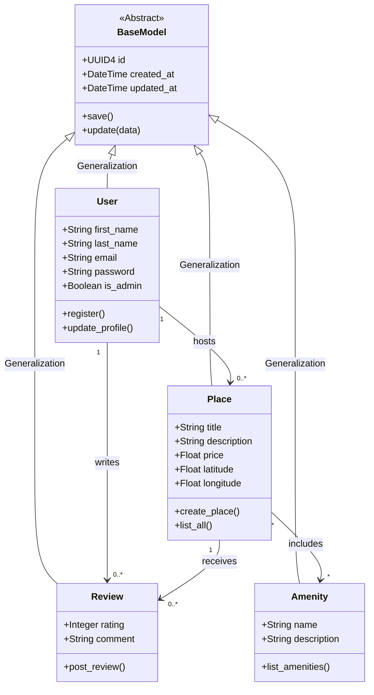
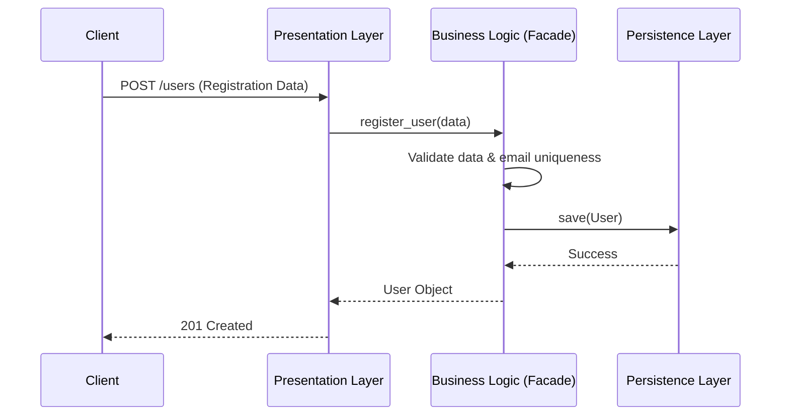
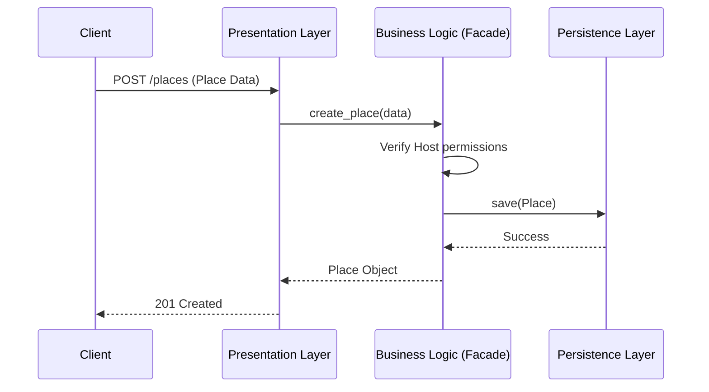
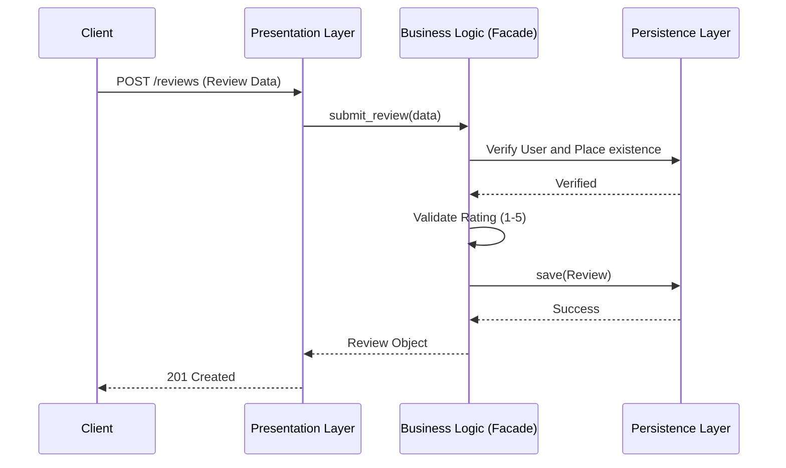
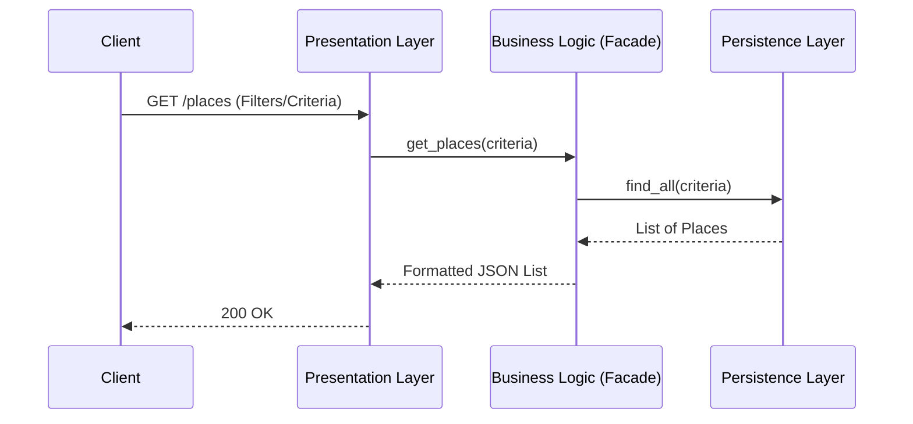

# HBnB Evolution: Technical Design Document

## Introduction
This document serves as the architectural foundation for the HBnB project. My goal here is to map out how the system components interact and how the data is structured within the core business logic. I've adopted a layered approach to ensure the code stays clean, maintainable, and easy to scale as we add more features.

---

## 1. High-Level Architecture (Package Diagram)

For the overall structure, I decided to use a **three-layer architecture**. This helps in keeping the user interface (API) separate from the actual "brain" of the app and the database storage logic.

To keep these layers from becoming a tangled mess, I implemented the **Facade Pattern**. Instead of the API talking to every single model or repository, it goes through a single entry point—the Facade. This simplifies the workflow and keeps the layers decoupled.

## 3. API Interaction Flows (Sequence Diagrams)

To visualize how these layers actually work in practice, I have mapped out the interaction flows for four key API operations. These diagrams show the step-by-step communication between the Client, the API, the Business Logic (via the Facade), and the Persistence layer.

### 3.1. User Registration
When a new user signs up, the system must validate the input and ensure the email is unique before committing the new entity to storage.

