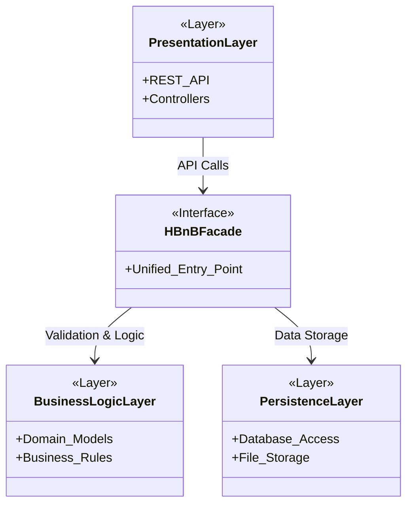
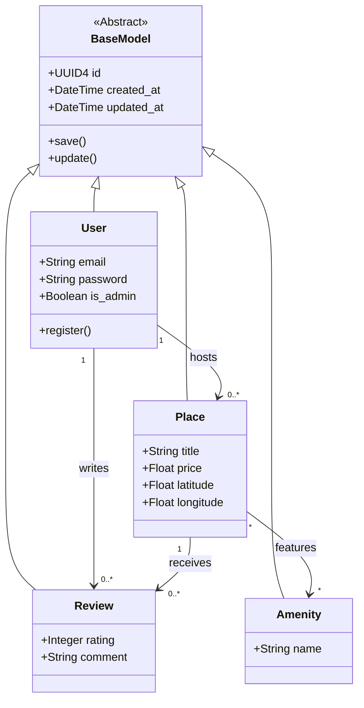
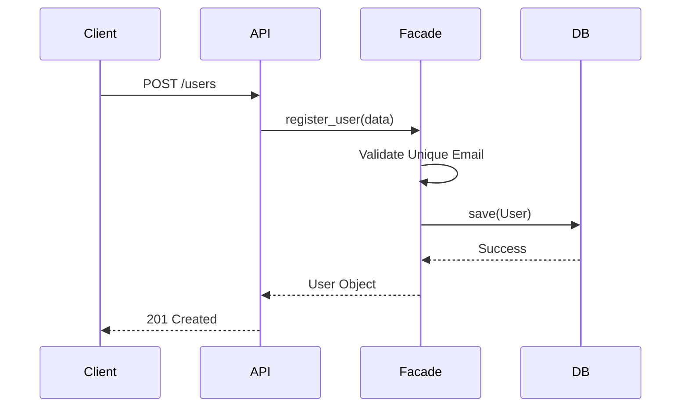
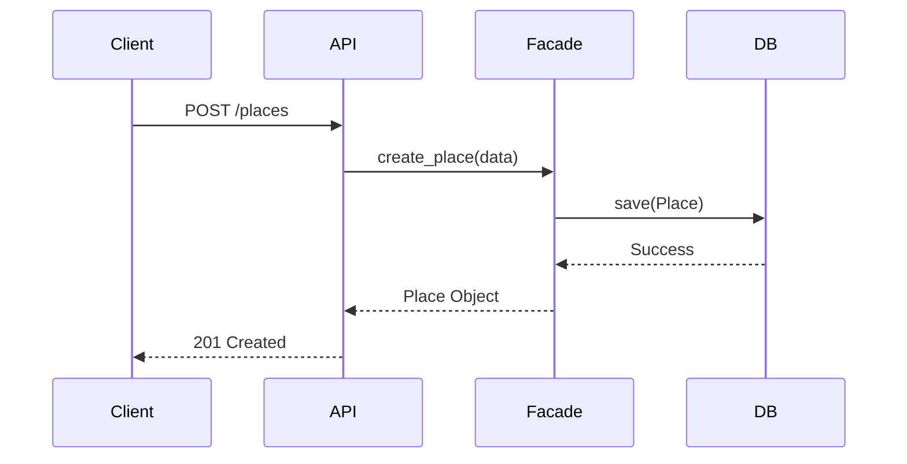
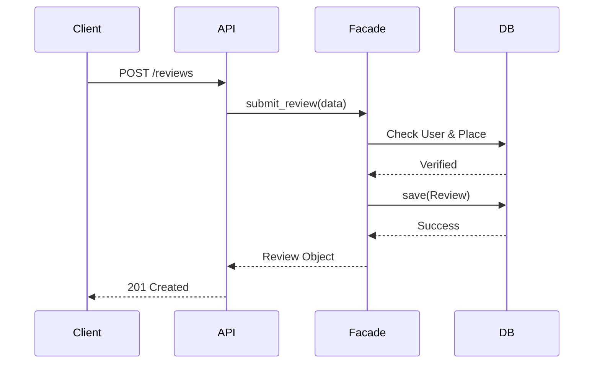
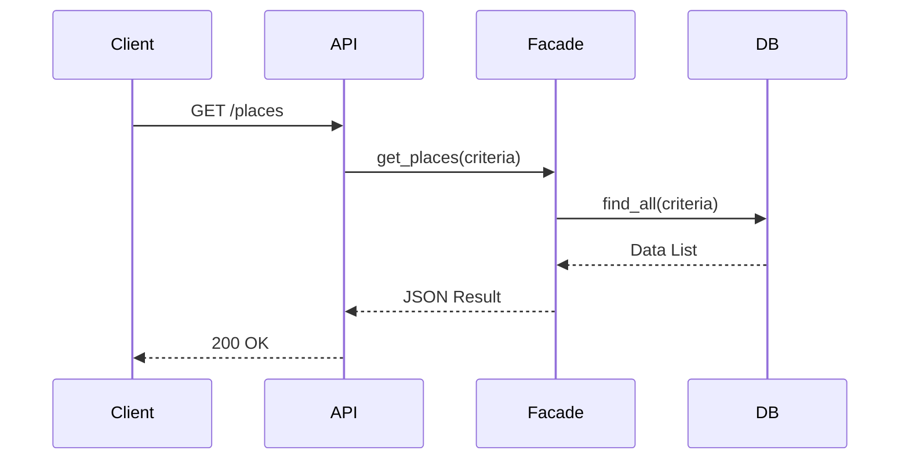

# HBnB Evolution: Complete Technical Blueprint

## Introduction
Welcome to the technical design documentation for the **HBnB Evolution** project. This document serves as a comprehensive guide for the development team, outlining the system's architecture, core business logic, and interaction patterns. 

Our goal is to build a scalable, Airbnb-like platform where users can manage properties, post reviews, and discover amenities. To ensure long-term maintainability, this blueprint follows a strict layered architecture, keeping the "how" (technical details) separate from the "what" (business value).

---

## 1. High-Level System Architecture

To handle the complexity of the HBnB ecosystem, I have adopted a **Three-Layer Architecture**. This design ensures that each part of the system has a single responsibility.

### Architectural Diagram
The following package diagram shows the three main layers and how they interact through a central gateway.

