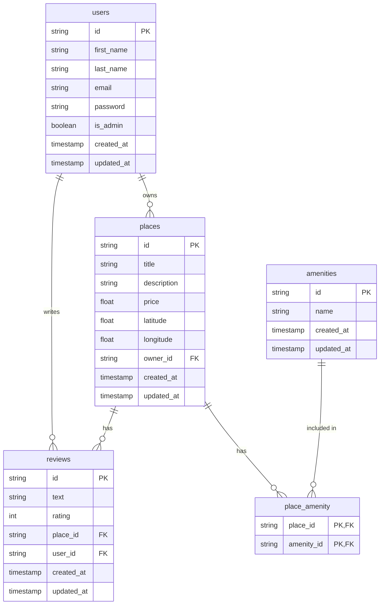

# HBnB Database ER Diagram

This document illustrates the relational database schema for the HBnB project using a Mermaid.js Entity-Relationship diagram.

```mermaid
erDiagram
    users {
        string id PK
        string first_name
        string last_name
        string email
        string password
        boolean is_admin
        timestamp created_at
        timestamp updated_at
    }

    amenities {
        string id PK
        string name
        timestamp created_at
        timestamp updated_at
    }

    places {
        string id PK
        string title
        string description
        float price
        float latitude
        float longitude
        string owner_id FK
        timestamp created_at
        timestamp updated_at
    }

    reviews {
        string id PK
        string text
        int rating
        string place_id FK
        string user_id FK
        timestamp created_at
        timestamp updated_at
    }

    place_amenity {
        string place_id PK,FK
        string amenity_id PK,FK
    }

    users ||--o{ places : "owns"
    users ||--o{ reviews : "writes"
    places ||--o{ reviews : "has"
    places ||--o{ place_amenity : "has"
    amenities ||--o{ place_amenity : "included in"
```
